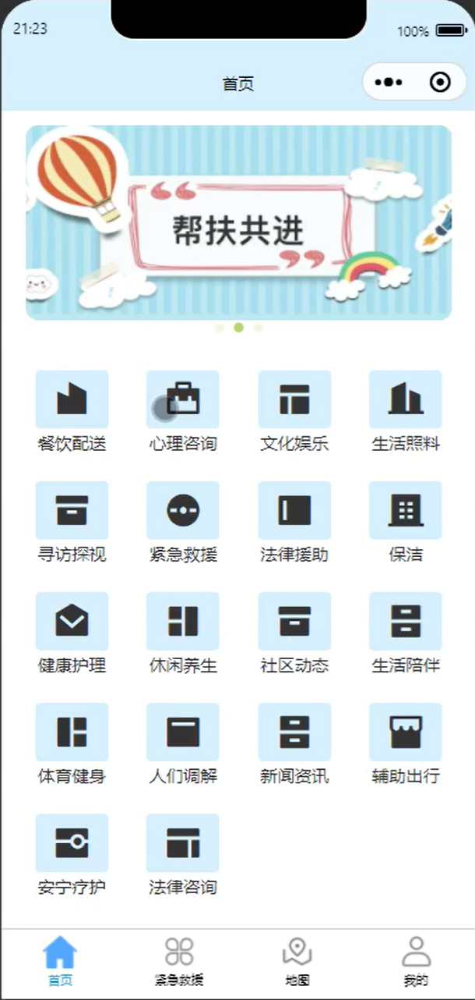
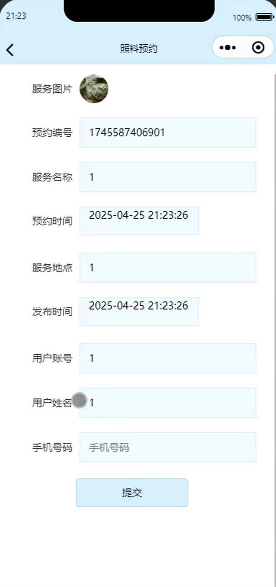
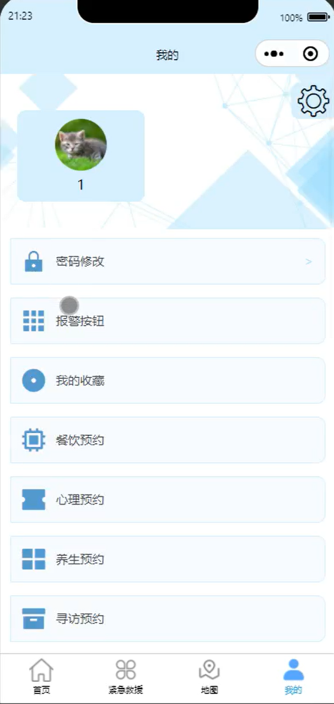
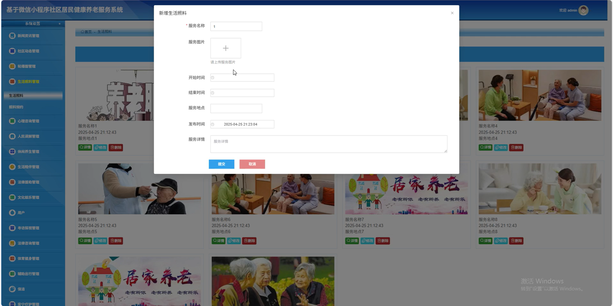

# mpweixinA205D
mpweixinA205D社区居民健康养老微信小程序
 
## 源码问题查看主页咨询

### 一、关键词
社区动态管理，生活照料管理，休闲养生管理

### 二、作品包含
源码+数据库+全套环境和工具资源+本地部署教程

### 三、项目技术
前端技术： Html、Css、Js、Vue3.0、Element-plus
后端技术：Java、SpringBoot3.0、MyBatis

### 四、运行环境（以下版本亲测，其他版本兼容性请自行测试）
开发工具：IDEA/eclipse  + VSCODE + 微信开发者工具

数据库：MySQL5.7（最低要5.7版本）

数据库管理工具：Navicat10以上版本

环境配置软件： JDK17 + Maven3.6.3

前端Nodejs：20

浏览器：谷歌浏览器

### 五、项目介绍
项目编号：mpweixinA205D

社区居民健康养老微信小程序可为社区居民提供健康管理，便捷居民日常健康养老需求的解决。

角色：管理员、用户

管理员：首页、紧急救援管理、新闻资讯管理、社区动态管理、轮播图管理、生活照料管理、心理咨询管理、人民调解管理、休闲养生管理、生活陪伴管理、法律援助管理、文化娱乐管理、用户、寻访探视管理、法律咨询管理、体育健身管理、辅助出行管理、保洁、安宁疗护管理。

用户：首页、紧急救援、地图、我的、密码修改、报警按钮、我的收藏、餐饮预约、心理预约、养生预约、寻访预约、健身预约、调解预约、保洁预约、护理预约、咨询预约、照料预约、陪伴预约、娱乐预约、辅助预约、疗护预约、援助预约。

### 六、运行截图

